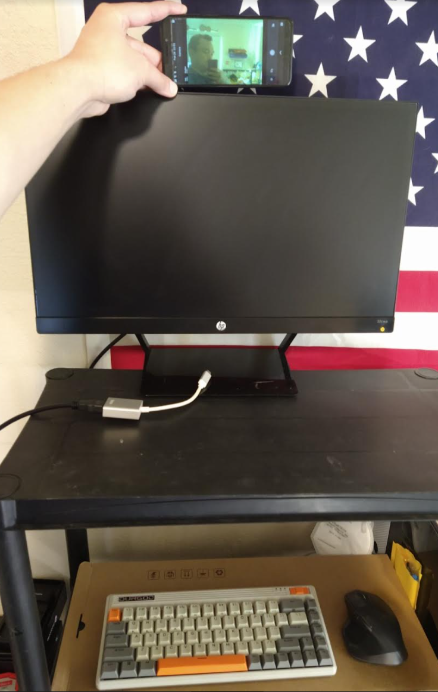
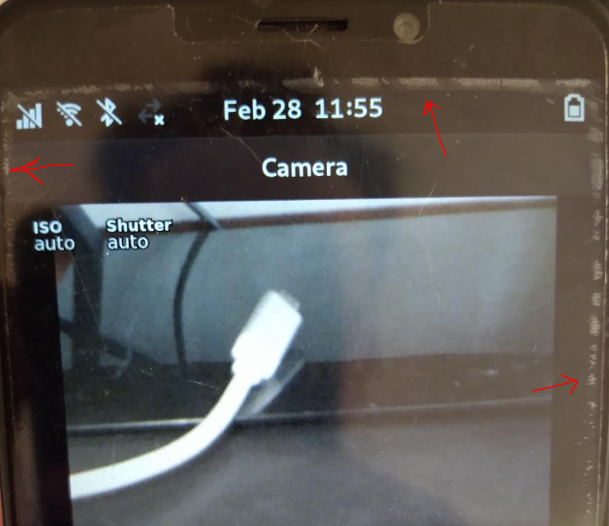
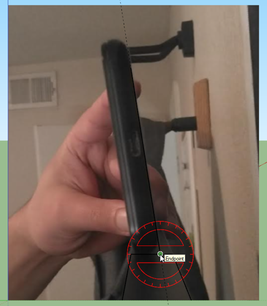
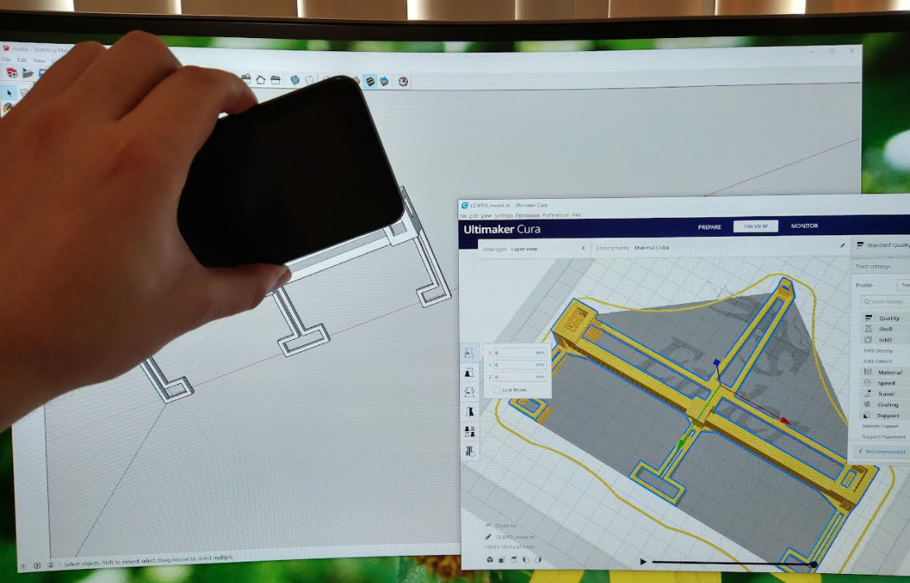

I'm antsy waiting for the phone to get delivered to me.

In the meantime I'm going to design a holder for it to hold the phone above a monitor using the dimensions of the original Pinephone.

The Pinephone Pro is a little bigger.

This is going to be my setup, will slow me down a little, I'm used to a big monitor/powerful desktop.

Look at that nasty yellow front-facing camera feed ha.

This keyboard is also not one of my favorites.

Display is HP 22cwa 21.5in 1080P

Unfortunately my original Pinephone's display is starting to come apart for some reason.

Trying to figure out what's a design that allows changing the angle. Probably a bump that you ratchet over.

Unfortunately the mount design will be unique to this monitor.

Luckily the back is just a flat slab.

15 mm monitor thickness, 7mm down

There is a lip/not flush on the front.

hard to tell how tall the lip is.

Nvm the edges are little warped here and there but it's essentially flush.

Look at me I'm being a good boy designing in mm

I'll put the design on Thingiverse too first one for me

0.5mm will be my offset/clearance/tolerance dimension

81 deg is the tilt towards me so I guess I'd just call it 80.

Maybe 20 deg increments is good enough.

I'm feeling lazy, won't even bother with adjustable rotation. Thing is I'm trying to avoid a screw of some kind.

You probably can design a compression-fit swivel joint thing.

Ugh... 3PM still waiting for it

I've gotten far in the design though.

Oh man this is a 5hr print

Concern is I have not checked if the fit is right.

So I'll probably cut a portion out to test print and see how it fits.

Like a tiny slice of the main cage dimensions

Ugh I'm just sitting here waiting for it because I don't want them to miss me and I have to drive like 20 miles to get it.

So for now I'll do some research. I'm also on the verge of falling asleep but I have to stay up until say 9 PM

I'll spend tomorrow to develop the app, I'll start researching today but I'm already spent though mentally been up for 11 hours already

# Software

OS is Manjaro with Plasma Mobile for UI

Yeah it's probably going to take me a bit to develop this app.

Like I have no idea what manjaro is.

This is driving me nuts, I've been sitting in silence because I need to wait for this guy who I'm hoping knocks on my door and boom I have my package... instead of "can't make it", takes it back to wherever they are and I have to drive out there and get it tomorrow.

Not like I will get much done right now I'm so tired/burnt.

I have something big to make for my day job which will take me idk a whole week to prototype out... after the design is planned on it I'll work on that.

So I scaled down this app, my first app will be a cliche CRUD app (note taking).

I really want to get it done in a day... aside from learning the environment I think I know enough with my knowledge know to put together some UI and use sqlite or something to store data locally and get something working. End goal being an app icon that shows up in the phone and is useable.

Well it didn't arrive yet... guess tomorrow.

One thing I would like to setup is emulating Pinephone in a VM so I can develop with my preferred machine after I do the meta dog food post.

